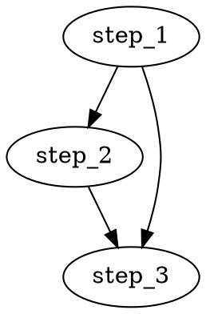
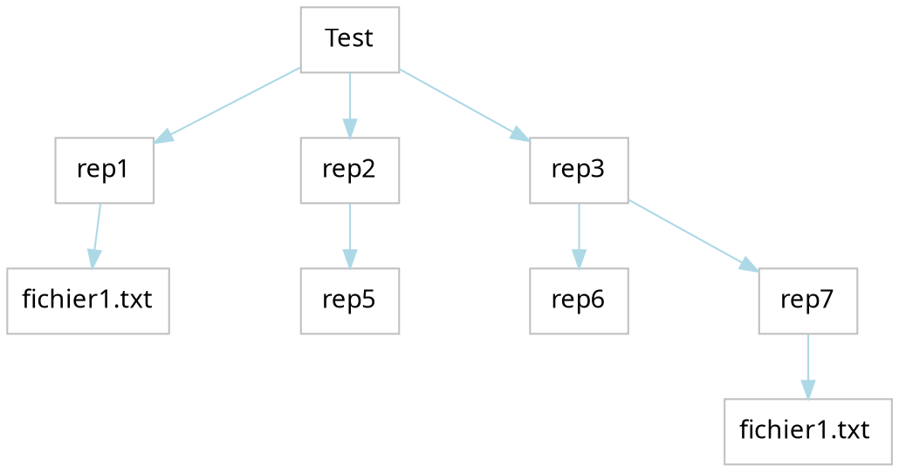
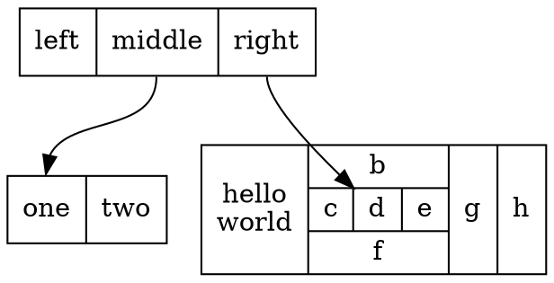
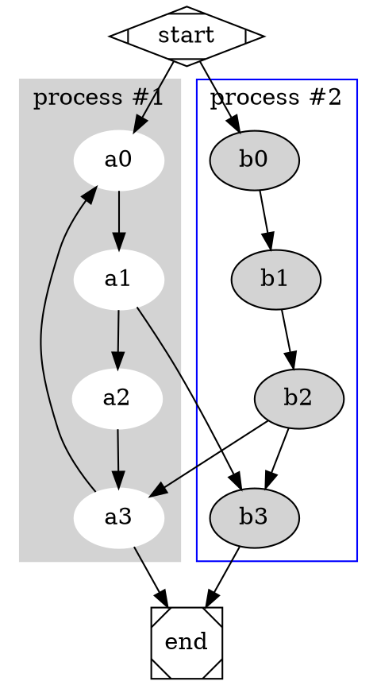
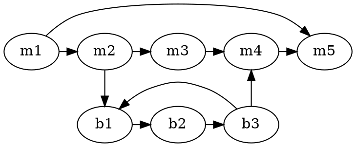
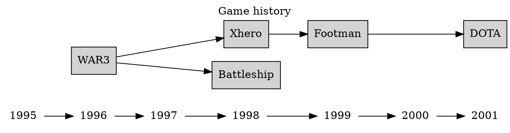
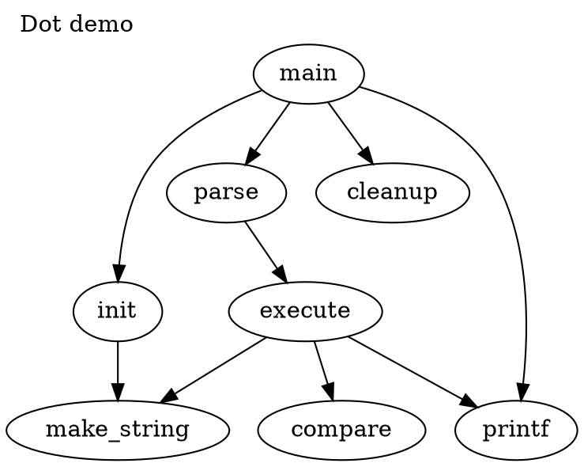

# Memo graphviz

à consulter : [GraphViz Pocket Reference](https://graphs.grevian.org/example)
et [attributs graphviz](http://www.graphviz.org/doc/info/attrs.html)

 #### Arborescence des fichiers

