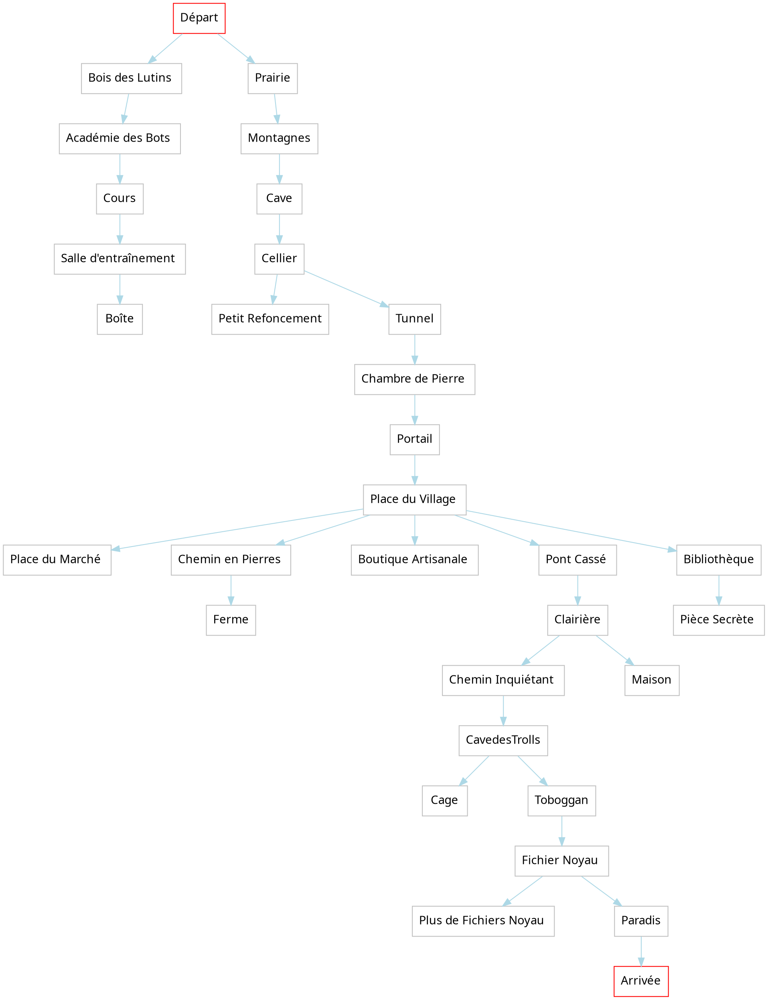
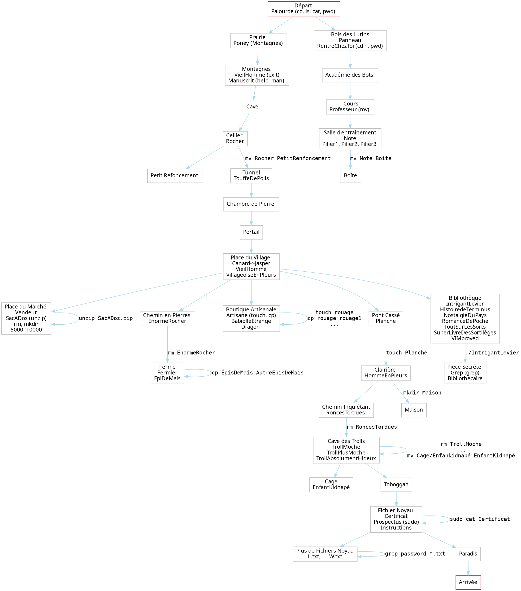

# Terminus

## Plan

```graphviz
digraph terminus {
  nodesep=1 // Increases the separation between nodes

  node [color=Grey,fontname=Optima,shape=box] // All nodes will this shape and colour
  edge [color=Lightblue] // All the lines look like this
  
Départ [color="red"];
BoisDesLutins [label="Bois des Lutins "];
AcadémieDesBots [label="Académie des Bots "];
SalleDentraînement [label="Salle d'entraînement "];
PetitRefoncement [label="Petit Refoncement"];
ChambreDePierre [label="Chambre de Pierre "];
PlaceDuVillage [label="Place du Village "];
PlaceDuMarché [label="Place du Marché "];
CheminEnPierres [label="Chemin en Pierres "];
BoutiqueArtisanale [label="Boutique Artisanale "];
PontCassé [label="Pont Cassé "];
PièceSecrète [label="Pièce Secrète "];
CheminInquiétant [label="Chemin Inquiétant "];
FichierNoyau [label="Fichier Noyau "];
PlusDeFichiersNoyau [label="Plus de Fichiers Noyau "];


Départ ->{Prairie BoisDesLutins}
BoisDesLutins -> AcadémieDesBots -> Cours -> SalleDentraînement -> Boîte
Prairie -> Montagnes -> Cave -> Cellier
Cellier ->{PetitRefoncement Tunnel}
Tunnel ->ChambreDePierre -> Portail-> PlaceDuVillage
PlaceDuVillage ->{PlaceDuMarché Bibliothèque CheminEnPierres BoutiqueArtisanale PontCassé}
Bibliothèque->PièceSecrète
CheminEnPierres -> Ferme
PontCassé ->Clairière ->{Maison CheminInquiétant}
CheminInquiétant -> CavedesTrolls->{ Cage Toboggan}
Toboggan ->FichierNoyau->{PlusDeFichiersNoyau Paradis}
Paradis -> Arrivée 
Arrivée [color="red"]

{rank=same;  } // Put them on the same level
}
```

## Interactions

```graphviz
digraph terminus {
  nodesep=1 // Increases the separation between nodes

  node [color=Grey,fontname=Optima,shape=box] // All nodes will this shape and colour
  edge [color=Lightblue, fontname=courier] // All the lines look like this
  
Départ [color="red", label="Départ 
Palourde (cd, ls, cat, pwd) "];

Prairie [label="Prairie 
Poney (Montagnes)"];

BoisDesLutins [label="Bois des Lutins
Panneau
RentreChezToi (cd ~, pwd)"];

AcadémieDesBots [label="Académie des Bots "];
Cours [label=" Cours
Professeur (mv) "];

SalleDentraînement [label="Salle d'entraînement
Note
Pilier1, Pilier2, Pilier3 "];

Montagnes [label="Montagnes 
VieilHomme (exit)
Manuscrit (help, man) "];

PetitRefoncement [label="Petit Refoncement "];

ChambreDePierre [label="Chambre de Pierre "];

PlaceDuVillage [label="Place du Village 
Canard->Jasper
VieilHomme
VillageoiseEnPleurs" ];

PlaceDuMarché [label="Place du Marché 
Vendeur
SacÀDos (unzip)
rm, mkdir
5000, 10000" ];

CheminEnPierres [label="Chemin en Pierres 
ÉnormeRocher" ];

BoutiqueArtisanale [label="Boutique Artisanale
Artisane (touch, cp)
BabiolleÉtrange
Dragon "];

PontCassé [label="Pont Cassé
Planche"];

PièceSecrète [label="Pièce Secrète 
Grep (grep)
Bibliothécaire"];

CheminInquiétant [label="Chemin Inquiétant
RoncesTordues "];

FichierNoyau [label="Fichier Noyau 
Certificat
Prospectus (sudo)
Instructions"];

PlusDeFichiersNoyau [label="Plus de Fichiers Noyau
L.txt, ..., W.txt"];

Cellier [label="Cellier 
Rocher"];

Tunnel[label="Tunnel
TouffeDePoils"];

Bibliothèque [label="Bibliothèque
IntrigantLevier
HistoiredeTerminus
NostalgieDuPays
RomanceDePoche
ToutSurLesSorts
SuperLivreDesSortilèges
VIMproved"];

Ferme[label="Ferme
Fermier
EpiDeMais"];

Clairière[label="Clairière 
HommeEnPleurs"];

CavedesTrolls[label="Cave des Trolls
TrollMoche
TrollPlusMoche
TrollAbsolumentHideux"];

Cage[label="Cage
EnfantKidnapé"];


Départ ->{Prairie BoisDesLutins}
BoisDesLutins -> AcadémieDesBots -> Cours -> SalleDentraînement
SalleDentraînement -> Boîte [label="mv Note Boite"]
Prairie -> Montagnes -> Cave -> Cellier
Cellier -> Tunnel [label="mv Rocher PetitRenfoncement"]
Cellier -> PetitRefoncement 

Tunnel ->ChambreDePierre -> Portail-> PlaceDuVillage
PlaceDuVillage ->{PlaceDuMarché Bibliothèque CheminEnPierres BoutiqueArtisanale PontCassé}

PlaceDuMarché ->PlaceDuMarché [label="unzip SacÀDos.zip", ]

BoutiqueArtisanale->BoutiqueArtisanale[label="touch rouage
cp rouage rouage1
..."]
Bibliothèque->PièceSecrète[label="./IntrigantLevier"]

CheminEnPierres -> Ferme[label="rm ÉnormeRocher"]

Ferme -> Ferme[label="cp ÉpisDeMais AutreEpisDeMais"]

PontCassé -> Clairière [label="touch Planche"]

Clairière -> Maison [label="mkdir Maison"]

Clairière->CheminInquiétant

CheminInquiétant -> CavedesTrolls [label="rm RoncesTordues"]
CavedesTrolls->Cage
CavedesTrolls->Toboggan
CavedesTrolls->CavedesTrolls[label="rm TrollMoche
...
mv Cage/Enfankidnapé EnfantKidnapé"]
 

Toboggan ->FichierNoyau->{PlusDeFichiersNoyau Paradis}
PlusDeFichiersNoyau->PlusDeFichiersNoyau[label="grep password *.txt "]
FichierNoyau ->FichierNoyau [label="sudo cat Certificat "]
Paradis -> Arrivée 
Arrivée [color="red"]

{rank=same;  } // Put them on the same level
}
```
